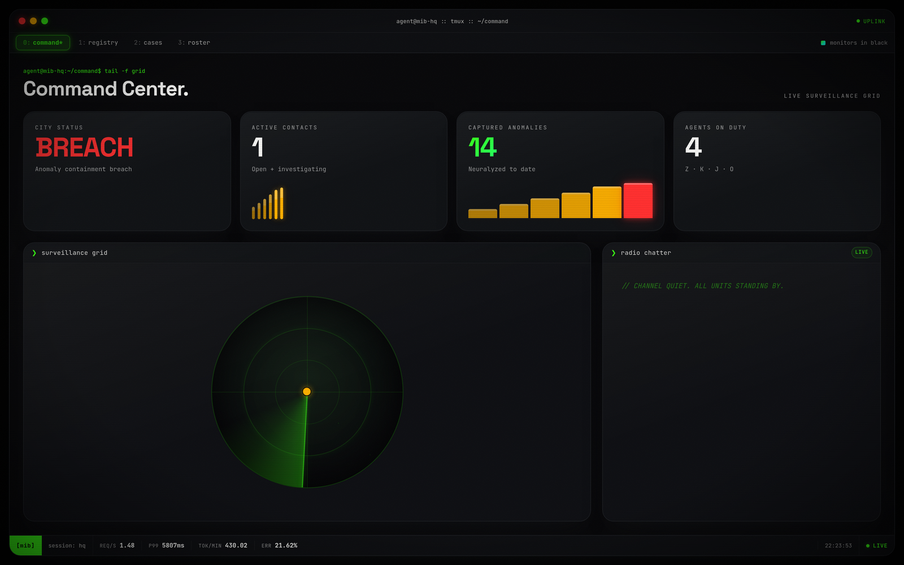
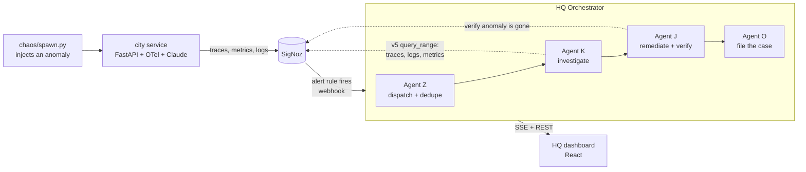
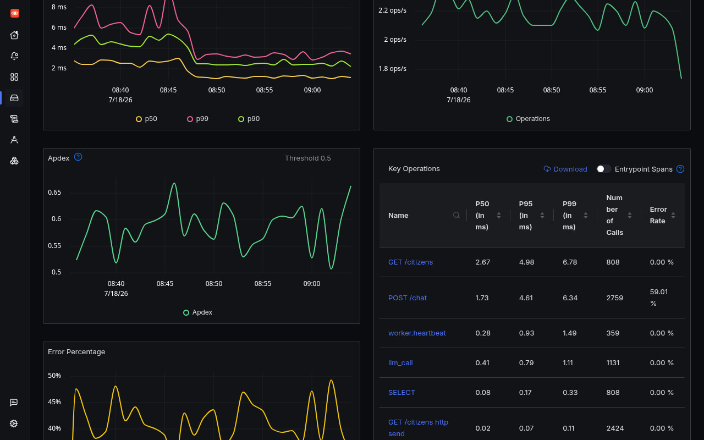
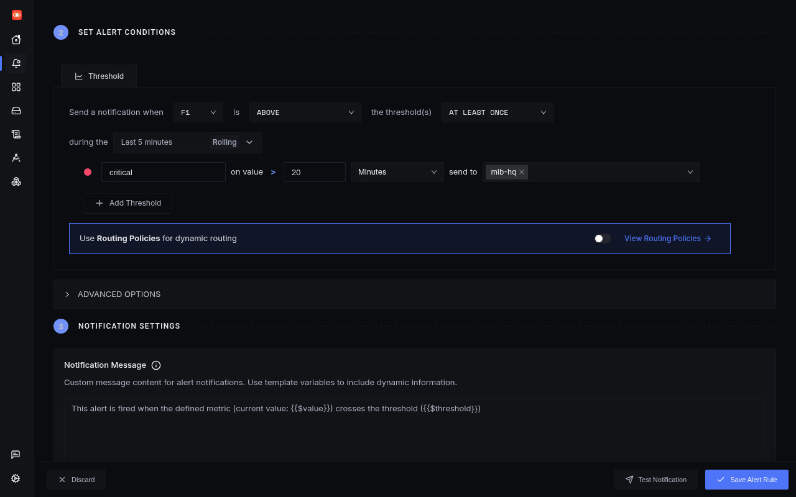
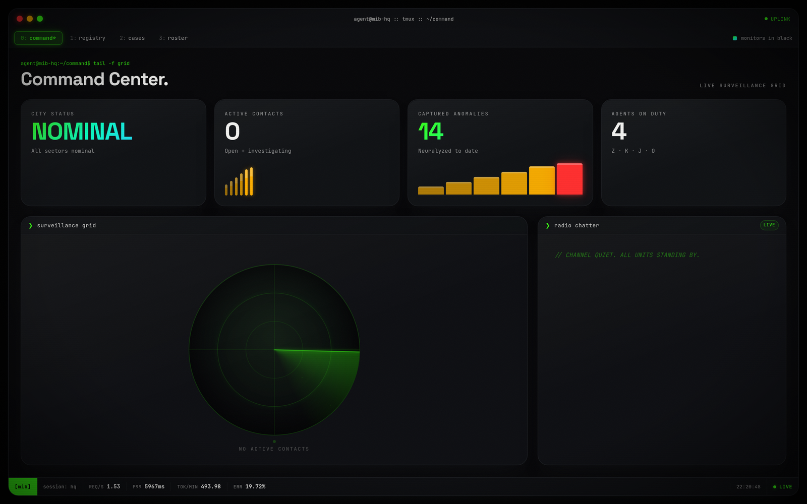
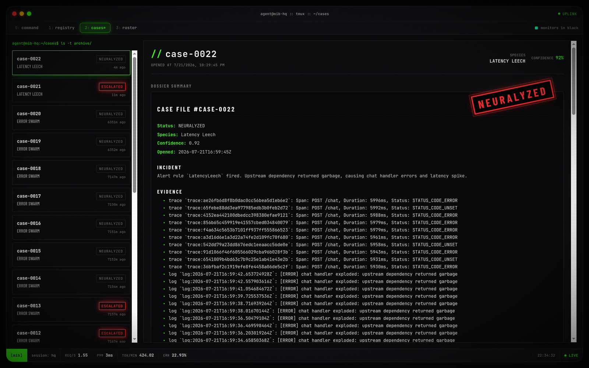
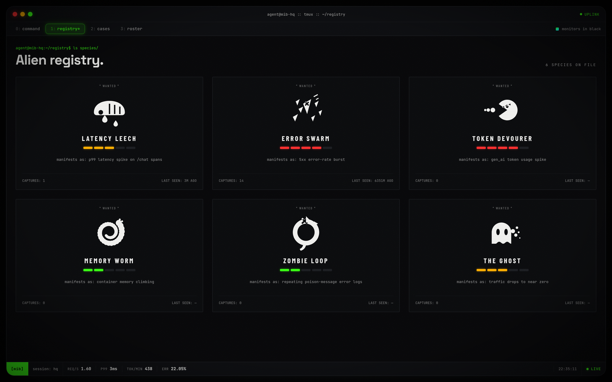
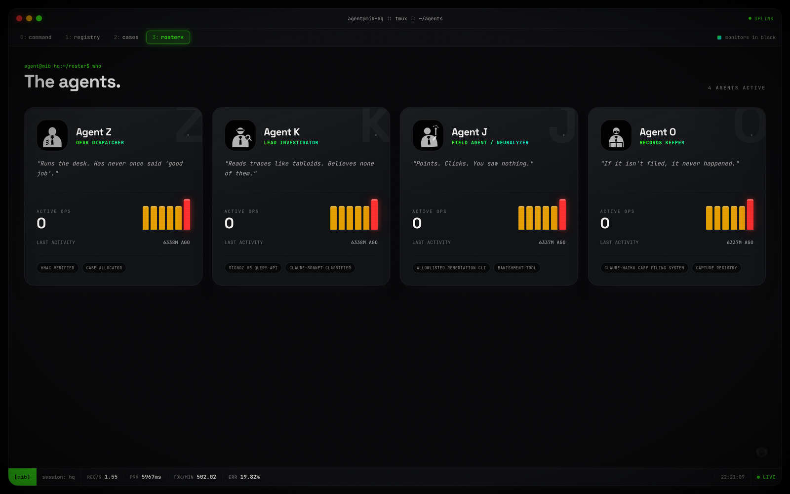

<div align="center">

# MONITORS IN BLACK

**Anomalies exist. We monitor them.**

An autonomous incident-response service for AI workloads. SigNoz sees the anomaly,
a four-agent pipeline investigates it, fixes it from a safe allowlist, verifies the
fix against live telemetry, and files the case. A noir HQ dashboard streams the hunt
as it happens.

Built for the **Agents of SigNoz** hackathon, Track 01 (AI & Agent Observability).




</div>

---

## The problem

An LLM service does not fail the way a CRUD service fails. It gets slower under
token pressure, it burns money silently, it retries poison messages forever, and it
returns a 200 with garbage inside. You can instrument all of that with
OpenTelemetry, and SigNoz will show it to you truthfully. Then the alert fires at
3am and a human still has to open five tabs, correlate a trace with a log with a
metric, guess the cause, and run the fix.

That gap between "the alert fired" and "someone did something about it" is where
this project lives.

**Monitors in Black closes the loop.** The same telemetry a human would read is read
by an agent instead. The agent forms a verdict with a confidence score, picks a
remediation from a hard allowlist, executes it, then goes back to SigNoz to prove the
anomaly is actually gone. If it cannot prove it, the case is escalated to a human
rather than silently marked resolved.

## The loop



1. **Something goes wrong.** `chaos/spawn.py` flips a flag and one of six "alien
   species" starts feeding on the city service.
2. **SigNoz notices.** The alert rule matching that species crosses its threshold and
   posts to the orchestrator webhook.
3. **Agent Z** dedupes the alert (five minute window, same rule means one case) and
   opens a case file.
4. **Agent K** queries SigNoz over the v5 `query_range` API in parallel: slow traces,
   error logs, custom LLM metrics. It hands that evidence to Claude Sonnet under a
   JSON schema and gets back `{species, root_cause, action_id, confidence}`.
5. **Agent J** runs the action, but only if `action_id` is in the allowlist and
   `confidence >= 0.6`. It then polls SigNoz for up to three minutes and requires two
   consecutive clean readings before calling the fix verified.
6. **Agent O** writes the case report in the house voice and files it.
7. Everything above streams to the HQ dashboard over Server-Sent Events while it
   happens.

Anything that fails a gate becomes `escalated`, never `neuralyzed`. A verified fix is
the only path to a closed case.

## What a real run looks like

Case-0022, produced by the pipeline against a live SigNoz on 2026-07-21. Nothing here
is mocked: a real alert rule fired, a real webhook landed, and Agent J proved the fix
before the case was allowed to close.

```console
$ python chaos/spawn.py latency_leech
latency_leech has crossed over. Watch the skies (and the dashboards).

$ curl -s localhost:8100/api/cases | jq '.[0] | {id, status, species, confidence, action}'
{
  "id": "case-0022",
  "status": "neuralyzed",
  "species": "latency_leech",
  "confidence": 0.92,
  "action": {
    "id": "restart_city",
    "executed_at": "2026-07-21T17:01:16Z",
    "verified": true,
    "result": "container city restarted and flags cleared"
  }
}
```

The report Agent O filed carries the exact evidence Agent K read out of SigNoz:

```markdown
# CASE FILE #case-0022

**Status:** NEURALYZED
**Species:** Latency Leech
**Confidence:** 0.92
**Opened:** 2026-07-21T16:59:45Z

## Incident
Alert rule `LatencyLeech` fired. Upstream dependency returned garbage, causing chat
handler errors and latency spike.

## Evidence
- trace `trace:ae26fb6d8f8b0dac0cc56bea5d1eb6e2`: Span: POST /chat, Duration: 5996ms, Status: STATUS_CODE_ERROR
- trace `trace:65febe88dd3ea977985edb3b0feb2d72`: Span: POST /chat, Duration: 5992ms, Status: STATUS_CODE_UNSET
- trace `trace:4152ea442100dbedcc398380efae9121`: Span: POST /chat, Duration: 5988ms, Status: STATUS_CODE_ERROR

## Action taken
`restart_city` executed, verified=True. container city restarted and flags cleared
```

The previous run on the same species, case-0021, ended `escalated` instead: the action
executed, but p99 had not dropped below threshold inside the verification budget, so
the pipeline refused to declare victory. That is the intended behaviour, and it is the
difference between an agent that fixes things and an agent that only claims to.

## The six species

Each species is a distinct failure mode of an LLM service, each with its own signal
type, its own alert rule, and its own remediation.

| Species | Threat | Failure mode | Signal SigNoz catches it with | Allowlisted fix |
|---|---|---|---|---|
| **Latency Leech** | 3 | `/chat` slows to a crawl | p99 of `POST /chat` spans above 2s | `disable_flag:latency_leech` |
| **Error Swarm** | 4 | 5xx burst on the chat handler | error span ratio above 20% | `disable_flag:error_swarm` |
| **Token Devourer** | 4 | prompt bloat burns completion tokens | `city.llm.output_tokens` rate above 50/s | `disable_flag:token_devourer` |
| **Memory Worm** | 2 | RSS climbs toward the container limit | `city.process.memory.rss` above 400MB | `restart_city` |
| **Zombie Loop** | 2 | poison message retried forever | log count matching `worker retry` above 20 | `purge_queue` |
| **The Ghost** | 3 | 90% of citizen traffic vanishes | `city.chat.requests` rate below 0.2/s | `restart_trafficgen` |

Traces, metrics, and logs are all represented on purpose. A demo that only reads
traces would not prove much about cross-signal correlation.

## The four agents

| Agent | Role | What it actually does |
|---|---|---|
| **Z** | Desk dispatcher | Constant-time webhook secret check, five minute dedupe window, allocates the case id |
| **K** | Lead investigator | Parallel SigNoz v5 queries, then Claude Sonnet under a JSON schema, returns species, root cause, action, confidence |
| **J** | Field agent | Executes one allowlisted action, then verifies it against SigNoz before anyone is allowed to relax |
| **O** | Records keeper | Renders the case report and files it to disk |

## Safety model

An agent with a shell is a liability. This one does not have a shell.

- **Allowlist, not codegen.** The model returns an `action_id` string. If it is not a
  key in `actions.ALLOWLIST`, nothing runs. The model never emits a command, a path,
  or an argument.
- **Confidence gate.** Below `0.6`, the case escalates without acting.
- **Verification loop.** Doing the thing is not the same as fixing the thing. Agent J
  re-queries SigNoz and needs two consecutive clean readings before marking the action
  verified. A timeout escalates.
- **Webhook auth.** The SigNoz channel must present the shared secret as
  `x-agency-token`, `x-mib-token`, a `?token=` query param, or basic auth. Compared
  with `hmac.compare_digest`.
- **Bounded evidence.** Evidence is truncated (`MAX_EVIDENCE_CHARS`) before it ever
  reaches the model, so a log flood cannot blow up the prompt.
- **Crash containment.** A pipeline exception writes a fault report and escalates the
  case instead of corrupting the case store.

The one deliberate demo compromise: the orchestrator mounts the Docker socket so
Agent J can restart a container. That is acceptable on a laptop and wrong in
production, where it would be a scoped API instead. It is called out in
`deploy/docker-compose.yml` too.

## Observability, in depth

This is the part that matters for a SigNoz hackathon, so here is exactly what is
wired up.

**Traces.** The city service is auto-instrumented (FastAPI, httpx, sqlite3) plus a
manual `llm_call` span carrying the OpenTelemetry GenAI semantic attributes:
`gen_ai.operation.name`, `gen_ai.provider.name`, `gen_ai.request.model`,
`gen_ai.response.model`, `gen_ai.usage.input_tokens`, `gen_ai.usage.output_tokens`.

**Custom metrics**, all defined in `city/app/otel.py`:

| Metric | Instrument | Why it exists |
|---|---|---|
| `city.chat.requests` | counter | traffic health, and how The Ghost is caught |
| `city.llm.output_tokens` | counter | token burn, and how Token Devourer is caught |
| `city.llm.cost_usd` | counter | the money view of the same workload |
| `city.process.memory.rss` | observable gauge | real VmRSS read from `/proc/self/status` |

**Logs.** Python logging is bridged into OTLP, so `worker retry` floods land in SigNoz
as queryable log records rather than in a terminal nobody is watching.

**Alerts.** Six rules, one per species, all notifying the `mib-hq` webhook channel.
Exported as `monitors-in-black/deploy/signoz/alert-rules.json`, described in
`monitors-in-black/deploy/signoz/alert-rules.md`.

**Dashboard.** Seven panels covering all three signal types, exported as
`monitors-in-black/deploy/signoz/dashboard-city-surveillance.json`. Every panel maps one to one onto an
alert rule, so the thing a judge looks at is the thing the agent reasons over.





> One gotcha worth writing down, because it cost real debugging time: SigNoz matches
> metric queries on temporality **exactly**. Counters are `cumulative`, observable
> gauges are `unspecified`. Ask with the wrong one and the v5 API returns
> `aggregations: null` rather than an error, so every custom counter silently reads as
> zero. `signoz_client.metric_series` now tries cumulative first and falls back.

## Quickstart

**Prerequisites:** Docker with Compose v2, at least 4GB free for SigNoz, Python 3.12
and Node 20 if you want to run pieces outside containers, and an Anthropic API key
(optional, there is an offline fallback).

**1. Self-host SigNoz**

```bash
git clone -b main https://github.com/SigNoz/signoz.git ~/signoz
cd ~/signoz/deploy/docker && docker compose up -d
```

Open http://localhost:8080, register, then create a service account API key under
**Settings > Service Accounts > Keys**.

**2. Configure**

```bash
cd monitors-in-black
cp .env.example .env
```

| Variable | Meaning |
|---|---|
| `ANTHROPIC_API_KEY` | agent brains and the city chatbot. Empty runs a heuristic offline mode |
| `SIGNOZ_URL` | SigNoz base URL, `http://localhost:8080` |
| `SIGNOZ_API_KEY` | service account key from step 1 |
| `OTEL_EXPORTER_OTLP_ENDPOINT` | collector endpoint, `http://localhost:4317` |
| `WEBHOOK_SECRET` | shared secret the SigNoz webhook channel must present |
| `CITY_MODEL` / `BRAIN_MODEL` | `claude-haiku-4-5` and `claude-sonnet-5` by default |

If SigNoz runs in its own Docker network, point `SIGNOZ_URL` and the OTLP endpoint at
the host bridge gateway (for example `172.18.0.1`) rather than `localhost`.

**3. Run the stack**

```bash
docker compose -f deploy/docker-compose.yml up -d --build   # city, trafficgen, orchestrator
cd hq-ui && npm install && npm run dev                      # HQ at http://localhost:5173
```

**4. Import the SigNoz assets**

Dashboard: **Dashboards > New > Import JSON**, paste
`monitors-in-black/deploy/signoz/dashboard-city-surveillance.json`.

Alert rules, after creating a webhook channel named `mib-hq` pointing at
`http://host.docker.internal:8100/hooks/signoz?token=<WEBHOOK_SECRET>`:

```bash
jq -c '.[]' deploy/signoz/alert-rules.json | while read -r rule; do
  curl -s -X POST "$SIGNOZ_URL/api/v1/rules" \
    -H "SIGNOZ-API-KEY: $SIGNOZ_API_KEY" \
    -H 'Content-Type: application/json' -d "$rule"
done
```

**5. Release an alien**

```bash
python chaos/spawn.py latency_leech   # or error_swarm, token_devourer,
                                      # memory_worm, zombie_loop, ghost
python chaos/spawn.py --status        # what is loose right now
python chaos/spawn.py --banish        # end all chaos
```

Then watch http://localhost:5173/command. The alert takes a minute or two to cross
its evaluation window, and the case appears the moment the webhook lands.

**Offline smoke test** (no SigNoz, no API key, simulates the webhook end to end):

```bash
python smoke.py
```

## The HQ dashboard

Five pages, no charting library, every number from a live endpoint.

| | |
|---|---|
|  |  |
| **Command Center.** City status, active contacts, a radar with one blip per open case, live radio chatter over SSE, and a metrics ticker fed by SigNoz. | **Case Files.** Every dossier: species, confidence, the exact evidence Agent K read, the action Agent J took, and a NEURALYZED or ESCALATED stamp. |
|  |  |
| **Registry.** The six species, threat levels, capture counts, and when each was last seen. | **Roster.** The four agents, their tooling, and their real activity pulled from case history. |

## API

The orchestrator serves the webhook and everything the UI needs.

| Method | Route | Purpose |
|---|---|---|
| `POST` | `/hooks/signoz` | Alertmanager-format webhook. Auth required. Skips resolved alerts, dispatches per alert |
| `GET` | `/api/cases` | All case files, newest first |
| `GET` | `/api/registry` | Species registry with capture counts |
| `GET` | `/api/stats` | Aggregate counters for the status tiles |
| `GET` | `/api/metrics-snapshot` | Live req/s, p99, tokens/min, error rate from SigNoz (10s cache) |
| `GET` | `/api/events` | SSE stream of agent chatter and case updates |

## Layout

```
.
├── monitors-in-black/
│   ├── orchestrator/app/   # main, pipeline, brain, signoz_client, actions, store, bus, voice
│   ├── city/app/           # FastAPI victim service: main, otel, flags
│   ├── chaos/spawn.py      # alien spawner, flips species flags atomically
│   ├── trafficgen/         # steady citizen traffic against the city
│   ├── deploy/
│   │   ├── docker-compose.yml
│   │   └── signoz/         # alert rules (md + json), dashboard json, install guide
│   ├── hq-ui/src/          # React dashboard, 57 files
│   └── smoke.py            # offline end to end test
├── docs/images/            # screenshots used above
└── ARCHITECTURE.md         # one page system diagram
```

Roughly 2,000 lines of Python across eight orchestrator modules and the city service,
plus the React front end.

## What was verified, and what was not

Verified against a live SigNoz v0.133 instance on 2026-07-21:

- All seven dashboard panels return data through `/api/v5/query_range`, except the
  Zombie Loop panel, which is empty unless that species is loose.
- All six alert rules load and evaluate. The `LatencyLeech` rule was observed going
  from `inactive` to `firing` to a webhook to an open case.
- `/api/metrics-snapshot` returns real values (`req_per_s: 1.53`, `p99_ms: 5967`,
  `tokens_per_min: 493.98`) after the temporality fix noted above.
- The full Z to K to J to O pipeline ran end to end on a real alert twice: once
  escalating when verification failed (case-0021), once closing as `neuralyzed` with
  `verified: true` (case-0022).

Known limits:

- Single-node demo. The case store is JSON on disk with a lock file, not a database.
- The Docker socket mount is a demo shortcut, as described in the safety section.
- Alert rules must exist in SigNoz before the loop can start. There is no bootstrap
  beyond the curl snippet above.
- Screenshots are from a local run on one machine. Thresholds tuned for that machine
  will need retuning on yours.

## Credits

Built solo for the Agents of SigNoz hackathon by WeMakeDevs and SigNoz.
The Men in Black flavour is homage, not affiliation: no trademarked names, logos, or
assets are used, and every silhouette in the UI is original SVG.
